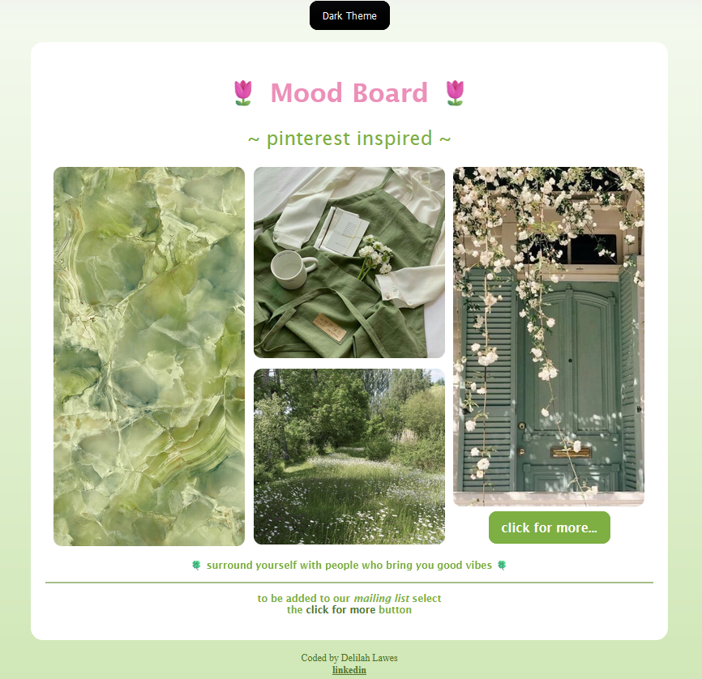
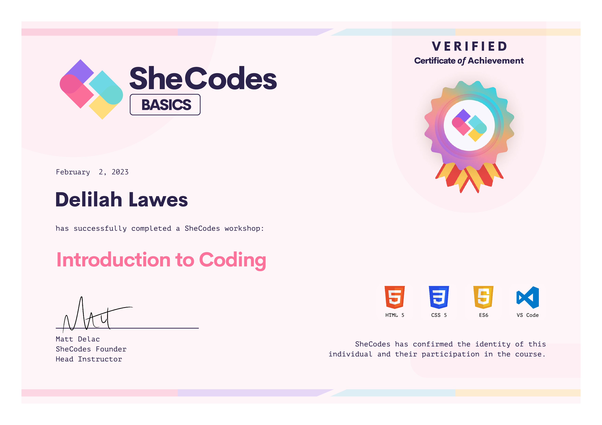

# Mood Board Project - SheCodes Basics

A Pinterest-inspired mood board created as the final project for SheCodes Basics workshop. This repository archives the original implementation.

## Project Preview

  

## Certificate

  

## About

This project was created as part of the SheCodes Basics workshop, implementing:

- Grid layout for Pinterest-style image display
- Basic dark/light theme toggle
- Simple form interactions
- CSS hover effects
- Single-file HTML structure

## Features

- Responsive image grid
- Dark mode toggle
- Mailing list signup
- Interactive hover effects

## Structure

The entire application is contained in a single HTML file, including:

- Inline CSS styling
- Embedded JavaScript
- Basic form validation
- Theme switching functionality

## Enhanced Version

An improved version of this project with modern features and better code organization can be found [here](link-to-new-repo)

> Note: This repository serves as an archive of the original SheCodes Basics submission. For the latest version with improved features and code structure, please visit the link above.
